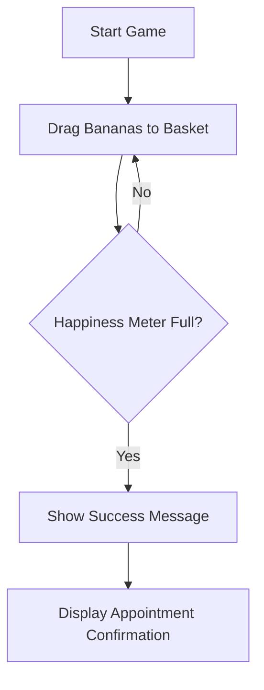

## 1. Product Overview
Convince Maggi is a fun mini-game where users drag bananas into a bunny's basket to fill her happiness meter and get an appointment. This playful interaction replaces traditional appointment forms with an engaging, memorable experience.

The game creates a delightful way to request appointments while incorporating humor through Maggi the bunny's reactions and messages.

## 2. Core Features

### 2.1 User Roles
Not applicable - single user interaction game

### 2.2 Feature Module
Our mini-game consists of the following main page:
1. **Game page**: banana dragging area, Maggi's basket, happiness meter, status messages, appointment success screen.

### 2.3 Page Details
| Page Name | Module Name | Feature description |
|-----------|-------------|---------------------|
| Game page | Banana area | Display draggable banana icons that users can click and drag |
| Game page | Maggi's basket | Visual basket target area that accepts dropped bananas |
| Game page | Happiness meter | Progress bar that fills as bananas are successfully dropped |
| Game page | Status messages | Display dynamic messages: "Maggi is sniffing your proposal...", "Maggi chewed the paperwork.", "Maggi approved your request." |
| Game page | Success screen | Show appointment confirmation when happiness meter is full |

## 3. Core Process
The user opens the game and sees Maggi the bunny with her basket and a happiness meter. Bananas appear scattered around the screen. The user drags bananas one by one into Maggi's basket. Each successful drop increases the happiness meter. When the meter reaches 100%, the game displays success messages and shows the appointment confirmation.

## 4. User Interface Design
### 4.1 Design Style
- Primary colors: Soft pastels (pink, yellow, light blue)
- Button style: Rounded, playful 3D effect
- Font: Friendly, rounded sans-serif (like Comic Sans or custom playful font)
- Layout style: Centered game area with floating elements
- Icons: Cute emoji-style bananas and bunny illustrations

### 4.2 Page Design Overview
| Page Name | Module Name | UI Elements |
|-----------|-------------|-------------|
| Game page | Banana area | Floating banana icons with subtle bounce animation, positioned randomly |
| Game page | Maggi's basket | Pink basket with bunny ears, positioned center-bottom with drop zone highlight |
| Game page | Happiness meter | Horizontal progress bar with heart icons, positioned top-center |
| Game page | Status messages | Speech bubble style text, positioned near Maggi |
| Game page | Success screen | Full-screen overlay with celebration animation and appointment details |

### 4.3 Responsiveness
Desktop-first design with mobile-adaptive layout. Touch interaction optimization for dragging bananas on mobile devices.

### 4.4 3D Scene Guidance
Not applicable - 2D game with CSS animations.