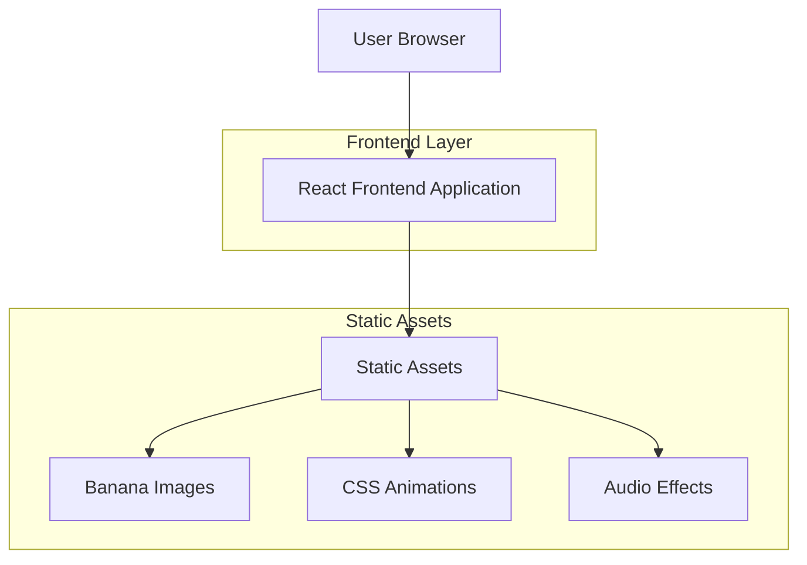

## 1. Architecture design

## 2. Technology Description
- Frontend: React@18 + tailwindcss@3 + vite
- Initialization Tool: vite-init
- Backend: None (static deployment)
- Deployment: GitHub Pages

## 3. Route definitions
| Route | Purpose |
|-------|---------|
| / | Main game page with Convince Maggi mini-game |

## 4. API definitions
Not applicable - static frontend only

## 5. Server architecture diagram
Not applicable - no backend services

## 6. Data model
Not applicable - no database required